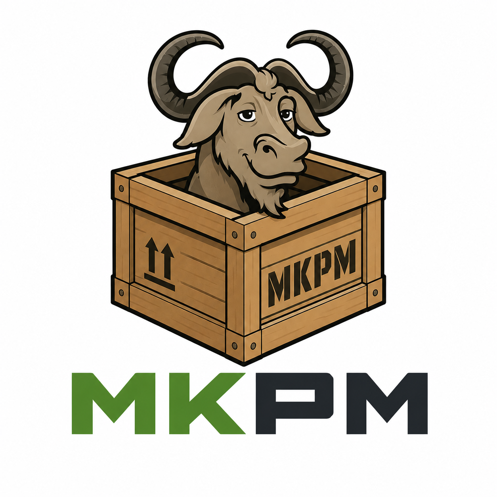

<p align="center">
  
</p>

[](https://github.com/fe18m/mkpm/actions/workflows/test.yml)

# MKPM - Make Package Manager

MKPM is a minimalist package manager for GNU Make. It lets you share and reuse Makefiles ("packages") across projects, resolved from either a local workspace or a remote OCI registry (via [ORAS](https://oras.land), a generic artifact store built on the OCI registry spec. Despite the container-focused names of registries like GHCR (Github Container Registry), it can push/pull any file, not just container images). It's implemented almost entirely in pure GNU Make.

## Requirements

* GNU Make >= 4.3
* Linux or macOS, amd64 or arm64 (macOS users need `brew install make` and should use `gmake`). You may create an alias to point make -> gmake

## Getting Started

Bootstrap mkpm into the current directory:

```bash
make -f <(curl -fsSL https://mkpm.io) install
```

**OR** if your shell doesn't support process substitution (`<(...)`), download the file first:

```bash
tmp=$(mktemp) && curl -fsSL https://mkpm.io -o "$tmp" && make -f "$tmp" install; rm -f "$tmp"
```

You'll be prompted to pick a registry for your packages. The easiest option is GitHub Container Registry (`ghcr.io`) using your GitHub username or organization; despite the "container" name, it works fine as a plain artifact store for mkpm packages (see [ORAS](https://oras.land)). Mkpm ships with an ORAS client in the form of a plugin as its default artifact store; to use a different registry, implement your own [plugin](#plugins).

This writes two files to your project:

* **`Makefile`**: a small bootstrap block that downloads and includes the real mkpm `Makefile` (or points at a local checkout via `mkpm_dir`, see below).
* **`.mkpmrc`** : your project's registry and plugins configuration (`reg=...`).

## Loading packages

Call `mkpm_load` anywhere in your `Makefile` to pull in a package:

```make
$(call mkpm_load,<package_name>)          # latest version
$(call mkpm_load,<package_name>@<version>)  # pinned version
```

A package is only loaded once per `make` invocation, even if `mkpm_load` is called for it multiple times (e.g. by multiple dependents).

## Creating a package

Any directory with an `mkpkg` file is a package. To scaffold one:

```bash
make mkpm-init name=<pkg-name>
```

This creates an `mkpkg` file in the current directory:

```
name=<pkg-name>
version=0.0.1
main=Makefile
```

* **`name`**: the package name used by `mkpm_load` and the registry.
* **`version`**: a semver string. Bump it with:
  ```bash
  make mkpm-semver-bump ver=1.2.3   # set explicitly
  make mkpm-semver-major            # X.y.z -> X+1.0.0
  make mkpm-semver-minor            # x.Y.z -> x.Y+1.0
  make mkpm-semver-patch            # x.y.Z -> x.y.Z+1
  ```
* **`main`**: the Makefile that gets `include`d when the package is loaded (defaults to `Makefile`).
* **`files`**: an optional comma-separated list of extra files to ship alongside `main`.
* **`templates`**: an optional comma-separated list of extra files to ship alongside `main` (e.g. scripts, config templates). When another project loads this package from a workspace, any templates it doesn't already have are copied into its directory.

Add your package's targets to `main`, using `$(call mkpm_help,<target>,<description>)` so they show up in `make help`. Then pack and publish:

```bash
make mkpm-pack      # tars main + templates + files into <name>@<version>.tgz
make mkpm-publish   # packs and pushes to the registry configured in .mkpmrc
```

## Config files

mkpm reads two `key=value` config files from the project root. `.mkpmrc.local` always takes precedence over `.mkpmrc` when both define the same key.

* **`.mkpmrc`**: committed, shared project configuration:
  * `reg`: the registry address (e.g. `ghcr.io/my-org`).
  * `plugins`: space-separated list of plugins to load. A `+name` entry loads a plugin bundled with mkpm (e.g. `+mkpm-oras`); a bare `name` fetches a custom plugin into `.mkpm_plugins/`. Defaults to `+mkpm-oras`.
  * `ws`: path (relative or absolute) to a local workspace directory, see [below](#local-packages-via-a-workspace).
  * `mkpm_dir`: path (relative or absolute) to a local checkout of mkpm itself, used instead of downloading a release (mainly for developing mkpm, or dogfooding it against a working tree: see `example/` and `registry/` in this repo).

* **`.mkpmrc.local`**: gitignored, personal overrides for the same keys, plus secrets that shouldn't be committed:
  * `reg_token`: registry credentials (e.g. a GitHub PAT with `read:packages write:packages` scope).
  * `reg_user`: registry username (defaults to `github`).

Example `.mkpmrc`:

```
reg=ghcr.io/my-org
plugins=+mkpm-oras
```

Example `.mkpmrc.local`:

```
reg_token=ghp_xxxxxxxxxxxx
```

## Local packages via a workspace

To develop and consume packages locally without publishing them, set `ws=<rel_or_abs_dir>` in `.mkpmrc` or `.mkpmrc.local` (similar to npm/yarn workspaces). When `mkpm_load` is called for a package that exists under that workspace directory, it's loaded directly from there instead of being fetched from the registry.

## Plugins

Plugins are the only supported way to implement the registry backend — `mkpm_publish` and `mkpm_download` raise an error until a plugin (or your own override) defines them. The bundled `mkpm-oras` plugin implements both on top of the `oras` CLI, installing it automatically if it's missing. Plugins can also add extra output to `make help` via an optional `help_hook`.

## Design Decisions

* Maximize ubiquity and cross-platform compatibility by leveraging Make's own built-in features.
* Core functionality that depends on external tools should be implemented as a plugin, not baked into the core.
* Since Make has no concept of local scoping, packages functions and vars should be defined with "@<package_name>" which is a special variable created after loading a package
* MKPM was not designed to become a scalable package manager such as NPM

## Known Limitations

* Make's variables are globally scoped, so mkpm has no elegant story for medium-to-large packaging systems.
* Package dependency resolution is simple, limited to exact semver matches. This may change in the future for a more complete / proper package resolution.